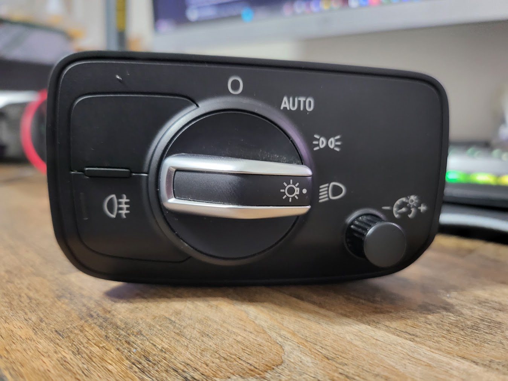
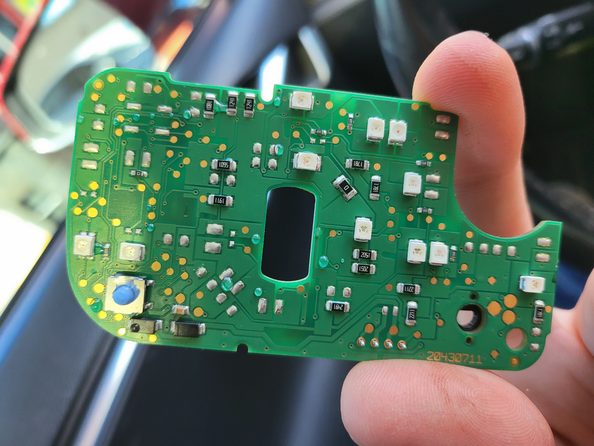
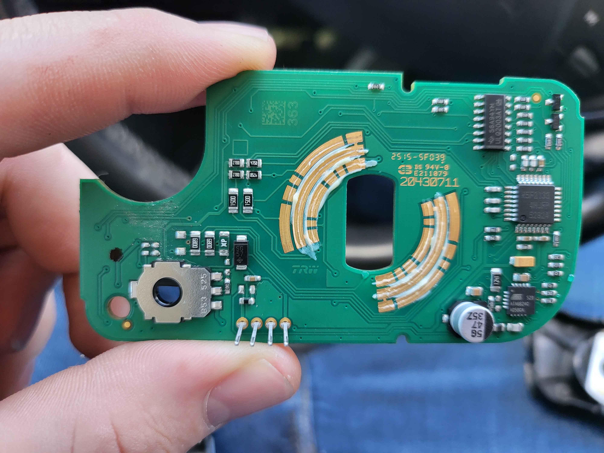

# Audi A3 Light Control Module

## Description
A 4 Wire Audi Headlight Control Module

## LIN Packet Info

| ID (Hex) | Description | Direction | Length (Bytes) | Byte 1 | Byte 2 | Byte 3 | Byte 4 | Byte 5 | Byte 6 |
|----------|-------------|-----------|----------------|-------------|-------------|-------------|-------------|-------------|-------------|
| 0x0B | Msg TO module for info | ReqInfo | 6 | Msg Counter | Light Control Position | Fog Light Button | Backlight Brightness | Unknown | Unknown | 

| Byte 1 | Byte 2 | Byte 3* | Byte 4 | Byte 5 | Byte 6 |
|----------------|----------------|----------------|----------------|----------------|----------------|
| Increments 1 each time the master sends a message | 0x01: Off   0x02: Auto   0x04: DRL   0x08: Headlights | 0xF0: Fog Off   0xF2: Fog On | Ranges from 0x80 : 0xE4 | N/A | N/A |

## Notes
*Byte 3: The module will turn this back off because I believe its waiting for a status signal to confirm the state of the fog light which is currently unknown

## Pinout
| Pin | Color | Description |
|---------|---------|----------------------------------------|
| 1 | gr/purp | LIN |
| 2 | grey/purp | +12V |
| 3 | brown | GND |
| 4 | green | Unknown |

#Images

## License
Distributed under the MIT License.
